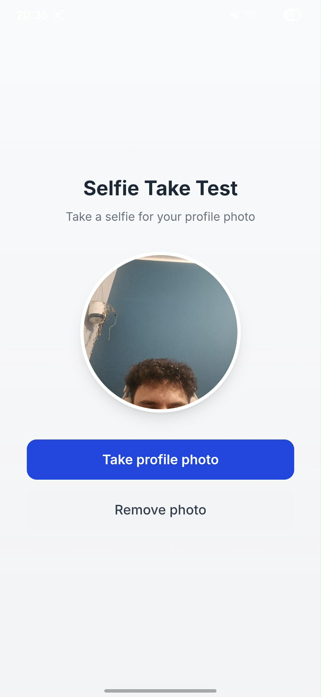

# Selfie Take Test



Simple app to take profile photo using device camera.

Tested on iPhone 15 Pro and Samsung Galaxy S24 Ultra, works fine on both.

## What you see

Main screen has a circle avatar placeholder in the center, and a blue "Take profile photo" button below. When you take a photo it shows up in the avatar. There's also a "Remove photo" button that appears after you take a photo.

## How it works

1. Tap the button
2. App asks for camera permission (first time only)
3. camera opens
4. Take a photo
5. Photo appears in the avatar

If you deny camera access or cancel, app shows an alert with error message.

## Accessibility

Buttons have aria-labels for screen readers. UI has good contrast and touch targets are big enough for easy tapping.

## Stack

Next.js 15, Capacitor 7, React 19, TypeScript, Tailwind CSS

---

## Quick Start

```bash
npm install
npm run build
npx cap sync
```

## iOS Testing

### Real iPhone (recommended)

1. Connect iPhone via USB
2. Enable Developer Mode: Settings -> Privacy & Security -> Developer Mode -> ON, then restart
3. Run `npx cap open ios`
4. In Xcode:
   - Select your iPhone from device list
   - Signing & Capabilities -> check "Automatically manage signing" -> select your Team
   - Cmd+R to build and run
5. First run on iPhone: Settings -> General -> VPN & Device Management -> Trust developer

### Simulator

```bash
npx cap open ios
```
Select simulator, press Cmd+R. Note: camera doesn't work on simulator.

## Android Testing

### Real Phone (recommended)

1. Enable Developer Options: Settings -> About phone -> tap "Build number" 7 times
2. Enable USB Debugging: Settings -> Developer options -> USB debugging -> ON
3. Connect phone via USB, select "File Transfer" mode, accept debugging prompt
4. Build and install:
```bash
cd android
./gradlew assembleDebug
adb install app/build/outputs/apk/debug/app-debug.apk
adb shell am start -n com.selfie.taketest/.MainActivity
```

### Emulator

```bash
npx cap open android
```
Wait for Gradle sync, select emulator, click Run.

## Test Cases

Happy path:
- App launches -> see title
- Tap "Take profile photo" -> permission prompt
- Allow camera -> camera opens
- Take photo -> photo appears in avatar
- Tap "Remove photo" -> avatar returns to placeholder

Edge cases:
- Deny camera permission -> alert "No camera access"
- Cancel photo taking -> alert "Cancelled"
- Take multiple photos -> each replaces previous

## Commands

```
npm run build          # build app
npx cap sync           # sync native projects
npx cap open ios       # open Xcode
npx cap open android   # open Android Studio
adb devices            # list Android devices
```

## Troubleshooting

iOS signing error: In Xcode go to Signing & Capabilities, select your Apple ID as Team.

ADB doesn't see device: Enable USB debugging, set USB mode to File Transfer, accept prompt on phone.

Camera error on Android: Check AndroidManifest.xml has CAMERA permission, rebuild with `./gradlew clean assembleDebug`.

## Project Structure

```
app/
  page.tsx        # main UI
  layout.tsx      # root layout
  globals.css     # styles
hooks/
  useCamera.ts    # camera logic
ios/              # native iOS
android/          # native Android
```

## Requirements

- Node.js 20+
- Xcode 15+ (Mac only)
- Android Studio (optional)
- Java 17+ (for Android)
